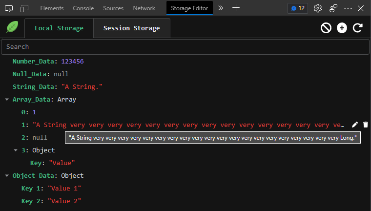

    

<h1 align="center">Storage Editor</h1>

A Editor for Local Storage and Session Storag.

## ✨ Feature
1. 🙈 Preview Local Storage and Session Storage Data as a tree.
2. ✏️ Edit, Add, Remove or Clear Storage Data.
3. 🔌 Add a New Node or Data to Object or Array.
4. 🔍 Search Value or Key in Storage Data Tree.

## ⚙️ Debug
1. Clone git repository in local.
2. Execute `npm install` to install dependencies.
3. Execute `npm run dev`.
4. Open browser and enable "Developer mode".
5. Click load an unpacked directory, and then choose `/<code directory>/dist`.
6. Restart Browser.

## 👀 Preview
1. Data Preview:
   
2. Edit Preview:
   

## 🔔 Others
* Icon made by [Freepik](https://www.flaticon.com/authors/freepik) from www.flaticon.com 